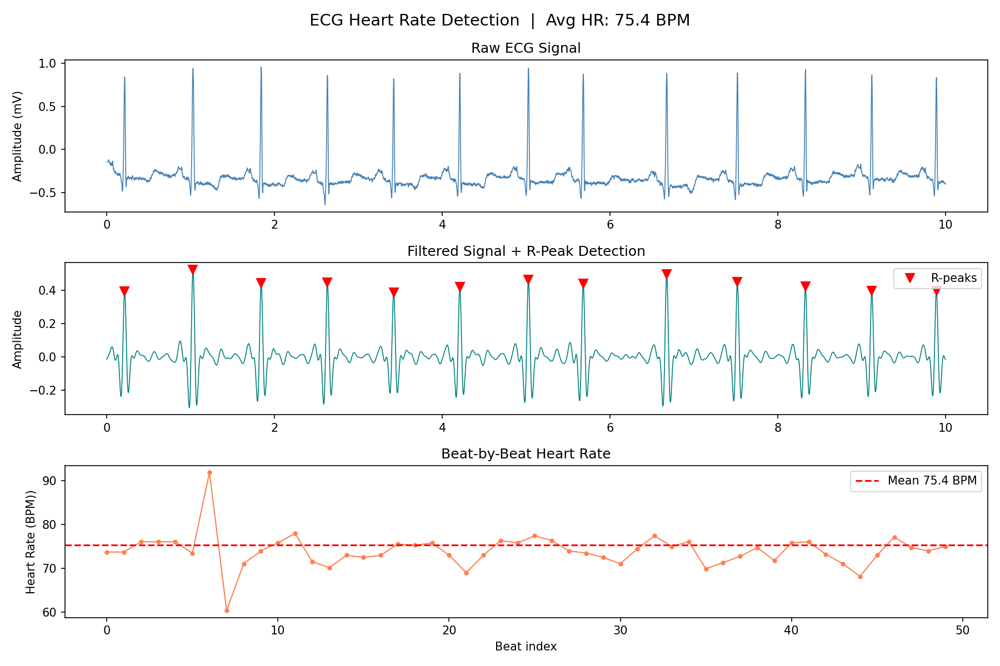

# ECG Heart Rate Detector

A Python tool for detecting heart rate from ECG signals using the MIT-BIH Arrhythmia Database.

## Results



- **Dataset**: MIT-BIH Arrhythmia Database (Record 100)
- **Sampling rate**: 360 Hz
- **Detected R-peaks**: 2255
- **Average heart rate**: 75.4 BPM

## Method

1. Load ECG signal via `wfdb` from PhysioNet
2. Apply bandpass filter (5–15 Hz) to remove baseline wander and high-frequency noise
3. Detect R-peaks using `scipy.signal.find_peaks`
4. Calculate beat-by-beat heart rate from R-R intervals

## Requirements

```bash
pip install wfdb scipy matplotlib numpy
```

## Usage

```bash
python ecg_hr_detector.py
```

Output: terminal summary + `ecg_result.png`

## References

- [MIT-BIH Arrhythmia Database](https://physionet.org/content/mitdb/1.0.0/)
- Moody GB, Mark RG. The MIT-BIH Arrhythmia Database. IEEE EMBS Magazine, 2001.